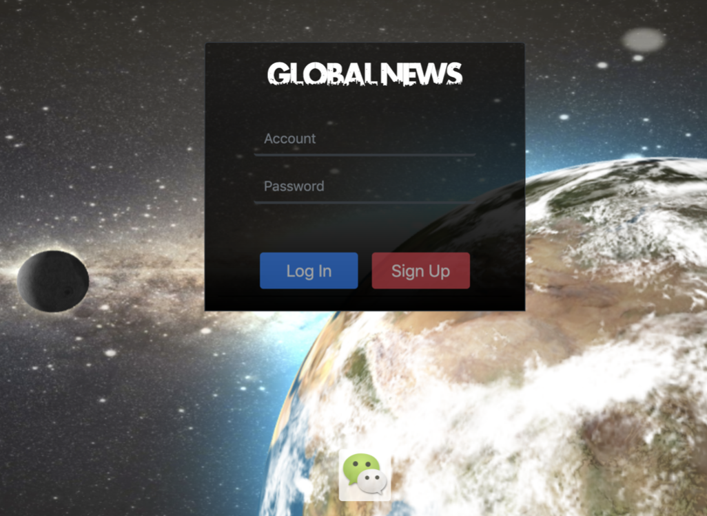

# World-News-Integration-Union
This is a web for global news integration with coresponding APIs.  
The function of the web including user sign up and login, changing personal information, news' display, update and comment, and redirect to news source page.  
   
This is the home page of the web which will direct the user to browse news categorized by country and area.      
  
This is the sign up page of the web and will guide the user to sign up when browsing for the first time.      
  
This is the login page of the web and user can login to commment and interact with other users.    
  
This is the page help user set up the profile image.    
  
This is the news page and can be seen that the news are displayed in list.    
  
This page is the page that user can leave a comment.    
  
This page shows that user can be redirected to the news source by clicking the botton.    
  
This is the page that user can post a thread by himself.    
